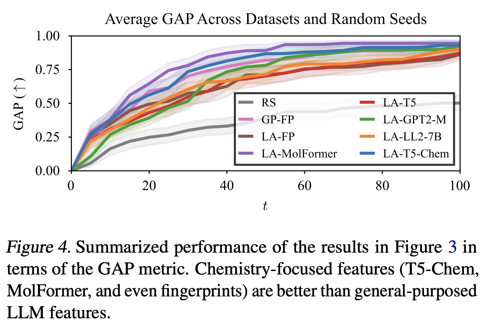
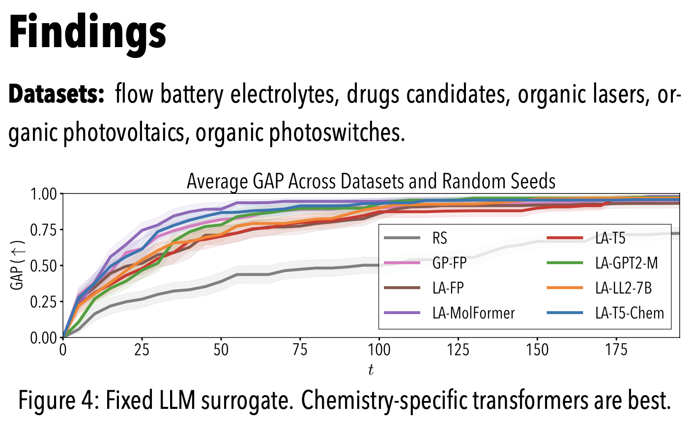

# Agustinus' _Very_ Opiniated Publication-Ready Plotting Library

<div align="center">

[](https://badge.fury.io/py/pub-ready-plots)
[](https://codecov.io/github/wiseodd/pub-ready-plots)


</div>

<br />

I love TikZ (btw). I love [tikzplotlib](https://github.com/nschloe/tikzplotlib). I've been an
advocate for the latter ([proof](https://agustinus.kristia.de/blog/plotting/)). However, tikzplotlib is [as good as dead](https://github.com/nschloe/tikzplotlib/commits/main/). I need to move on.

> [!IMPORTANT]
> Here's what I use now for all my publication needs. This library is designed to be
> _*very*_ opiniated. Beauty is in the eye of the beholder. Also, it is _very_ simple,
> just a single file and that's it.

> [!NOTE]
> Of course I still use TikZ whenever possible (e.g. Fig. 1 in a paper, diagrams, etc.)

## Examples

**Left:** ICML (letter size), single-column layout. **Right:** A0 landscape poster, 3-column layout.

<div align="center">
     &nbsp &nbsp &nbsp &nbsp 
</div>

<br />

```diff
import pub_ready_plots as prp

...

prp.get_context(
-   layout=prp.Layout.ICML,
+   layout=prp.Layout.POSTER_LANDSCAPE,
    ...
)

...
```

## Installation

Still with me? Still want to use this library? Here's how:

```bash
pip install pub-ready-plots
```

## Quick usage

```python
import pub_ready_plots as prp

# Wrap you current plotting script with this `with` statement.
# By default, this will create a full-width, 0.15*\textheight plot that conforms
# to the ICLR template.
with prp.get_context(layout=prp.Layout.ICLR) as (fig, axs):
    # Do whatever you want with `fig` and `axs`
    ...

    # Once your done, save it, but do NOT set `tight_layout=True`!
    fig.savefig("filename.pdf")
```

Then in your LaTeX file, include the plot as follows:

```tex
\includegraphics[width=\linewidth]{filename.pdf}
```

> [!IMPORTANT]
> The argument `width=\linewidth` is **crucial**! Also, do not specify the `height`
> option! Otherwise, your plot is distorted. (All measurements have been done in
> `pub-ready-plots`.)

That's it! But you should use TikZ more.
Anyway, see the full, runnable example in [`examples/simple_plot.py`](https://github.com/wiseodd/pub-ready-plots/blob/master/examples/simple_plot.py)
See [here](#all-available-options) for available options for `get_context()`!

> [!TIP]
> I recommend using this library in conjunction with
> [pypalettes](https://github.com/JosephBARBIERDARNAL/pypalettes)
> to avoid the generic blue-orange Matplotlib colors.
> Distinguish your plots from others!

## Advanced usages

### All available options

```python
import pub_ready_plots as prp

with prp.get_context(
    layout=prp.Layout.ICML,  # check `Layout` for all available layouts
    width_frac=1,  # multiplier for `\linewidth`
    height_frac=0.15,  # multiplier for `\textheight`
    single_col=False,  # only works for the "icml", "aistats", "uai" layouts
    nrows=1,  # depending on your subplots, default = 1
    ncols=2,  # depending on your subplots, default = 1
    override_rc_params={"lines.linewidth": 4.123},  # Overriding rcParams
    sharey=True,  # Additional keyword args for `plt.subplots`
) as (fig, axs):
    ...

    fig.savefig("filename.pdf")
```

### Creating plots for `\wrapfigure`

Say we want to have an inline figure of size `0.4\textwidth` and
height `0.15\textheight` in our NeurIPS paper.
Then all we have to do is the following:

```python
import pub_ready_plots as prp

with prp.get_context(
    layout=prp.Layout.NEURIPS, width_frac=0.4, height_frac=0.15,
) as (fig, axs):
    # Your plot here!
    ...
    fig.savefig("mywrapfigure.pdf")
```

In our LaTeX doc, we can then use the `wrapfig` package and do the following:

```tex
Some paragraph.

\begin{wrapfigure}[11]{r}{0.4\textwidth}
  \centering
  \includegraphics[width=\linewidth]{mywrapfigure.pdf}
  ...
\end{wrapfigure}

Some other paragraph.
```

> [!IMPORTANT]
> In the `\begin{wrapfigure}` statement, specify the correct figure size
> (in our case, `0.4\textwidth`). Then, in the `\includegraphics` statement,
> **_always_** specify `width=\linewidth` _without_ specifying the height.

### Using your own styles

Two options:

1. Use this library and update the resulting `rc_params` dict with your styles.
   - See [`examples/advanced_usage.py`](https://github.com/wiseodd/pub-ready-plots/blob/master/examples/advanced_usage.py)
2. Fork this repo and modify things as you wish.

## Other libraries

Check out [tueplots](https://github.com/pnkraemer/tueplots) if you want a more complex
library. My library is designed to achieve what **_I_** want in **_my_** papers and
posters, with as little code as possible. Because of this, it is very forkable and hackable.
